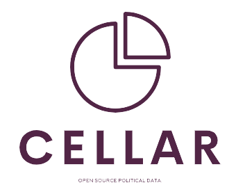

# Cellar Project



[Contributing]() | [Documentation]() | [Code of Conduct]() | [Slack Channel]()

Cellar is a project to use technology to make Nigerians' political data more open and accessible. This project aims to become the leading open-source, non-governmental source for political data and legislative statistics. The data we collect is presented in a rest json format to allow developers to use the data in building technologies for political accountability and research. 

## Usage
These instructions will get a copy of the project up and running on your machine for development and testing purposes.

## Prerequisites
To run this project locally, the following tools need to be installed:
* [Virtualenv](https://developer.mozilla.org/en-US/docs/Learn/Server-side/Django/development_environment)
* [Django](https://djangoproject.com)
* [Djangorestframework](https://django-rest-framework.org)

## Installation
Clone the project
 ```
 git clone https://github.com/bontusss/Cellar-Project.git
```

Move into the project directory and install it's dependencies.

```
$ pip install -r requirements.txt
```

Apply migrations

```
$ python manage.py migrate
```

You can now run the development server

```
$ python manage.py runserver
```

Navigate to [localhost:8000/api](http://localhost:8000/api)

To see a list of governors in Nigeria
Navigate to [localhost:8000/api/governors/](http://localhost:8000/api/governors/)
You will see data in the format below
```
[
    {
        "id": 1,
        "first_name": "Okezie",
        "last_name": "Ukandu",
        "other_names": "Bontus",
        "address": "Agon place, 78 Enugu - Abakaliki expressway",
        "started": "2022-09-19T19:06:17Z",
        "ended": "2022-09-20T19:06:25Z"
    },
    {
        "id": 2,
        "first_name": "John",
        "last_name": "Uduan",
        "other_names": "Timothy",
        "address": "Agon place, 78 Enugu - Abakaliki expressway",
        "started": "2022-09-19T19:07:10Z",
        "ended": "2022-09-19T19:07:14Z"
    }
]
```